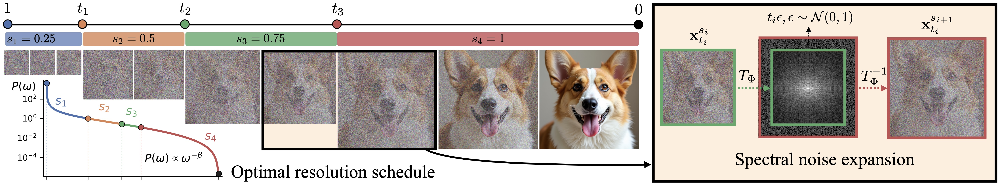

# Spectral Progressive Diffusion for Efficient Image and Video Generation (SPEED)

#### [[Project Website]](https://howardxiao.ca/speed/) [[Paper]](https://arxiv.org/abs/2605.18736) [[Demo]](https://huggingface.co/spaces/howardhx/speed/)

[Howard Xiao<sup>1</sup>](https://howardxiao.ca/), [Brian Chao<sup>1</sup>](https://bchao1.github.io/), [ Lior Yariv<sup>1</sup>](https://lioryariv.github.io/), [Gordon Wetzstein<sup>1</sup>](https://stanford.edu/~gordonwz/)</br>

<sup>1</sup>Stanford University 
</br>

Official code for **Spectral Progressive Diffusion for Efficient Image and Video Generation**. Currently supports training-free inference only.



```
@article{xiao2026spectral,
  author    = {Xiao, Howard and Chao, Brian and Yariv, Lior and Wetzstein, Gordon},
  title     = {Spectral Progressive Diffusion for Efficient Image and Video Generation},
  year      = {2026},
}
```

## Codebase Structure

- `utils.py`: spectral expansion, timestep alignment, and resolution transition scheduling.
- `configs.yaml`: checkpoint paths, power-spectrum coefficients, and model defaults.
- `latent_image_gen.py`: training-free latent image generation with FLUX.1-dev.
- `pixel_image_gen.py`: training-free pixel-space image generation with PixelGen.
- `latent_video_gen.py`: training-free latent video generation with WAN 2.1.
- `comfyui/`: ComfyUI custom SPEED sampler. Guide to use the SPEED sampler in ComfyUI is included in `comfyui/README.md`.
- `speed-generator/`: skill directory for coding agents such as Claude Code or Codex. It contains `SKILL.md` and a `scripts/` directory that can be used by agents directly. Move this folder to the `skills` directory of the coding agent.

## Setup
1. Install dependencies:
   We recommend using Python 3.11.0 to install the following dependencies. 
   ```bash
   pip install -r requirements.txt
   ```

2. Obtain the weights and source repositories the paths above point to:
   - **FLUX.1-dev** (`FLUX_DIR`): [`black-forest-labs/FLUX.1-dev`](https://huggingface.co/black-forest-labs/FLUX.1-dev) on Hugging Face (gated — accept the license first).
   - **PixelGen** source (`PIXELGEN_REPO`): clone [Zehong-Ma/PixelGen](https://github.com/Zehong-Ma/PixelGen). Checkpoint (`PIXELGEN_CKPT`): [`PixelGen_XXL_T2I.ckpt`](https://huggingface.co/zehongma/PixelGen) from `zehongma/PixelGen`. The config (`PIXELGEN_CONFIG`) ships in the repo at `configs_t2i/sft_res512.yaml`.
   - **WAN 2.1** source (`WAN_PATH`): clone [Wan-Video/Wan2.1](https://github.com/Wan-Video/Wan2.1). Checkpoint (`WAN_CKPT`): [`Wan-AI/Wan2.1-T2V-1.3B`](https://huggingface.co/Wan-AI/Wan2.1-T2V-1.3B) on Hugging Face.

3. (Optional if doing latent-image generation only): ensure that the specific dependencies required to inference PixelGen and WAN2.1 are satisfied from their respective source clones. 

4. Set environment variables pointing to the model checkpoints / repos:
   ```bash
   export FLUX_DIR=/path/to/FLUX.1-dev
   export PIXELGEN_REPO=/path/to/PixelGen        # source clone
   export PIXELGEN_CKPT=/path/to/PixelGen_XXL_T2I.ckpt
   export PIXELGEN_CONFIG=$PIXELGEN_REPO/configs_t2i/sft_res512.yaml
   export WAN_PATH=/path/to/Wan2.1              # source clone (importable as `wan`)
   export WAN_CKPT=/path/to/Wan2.1-T2V-1.3B
   ```

## Shared CLI

All three generation scripts share the same progressive-resolution inference interface:

| Flag         | Description |
| ---          | ---         |
| `--transform {dct,dwt,fft}` | Spectral basis used at each transition. Default: `dct` (Discrete Cosine Transform). |
| `--scales ...`              | Strictly increasing stage sizes ending at full resolution. Each value may be a decimal scale (`0.5`), a fraction (`1/2`, `2/3`), or a pixel height (`480 720`, where the last must equal `--height`). `--scales 1.0` runs the full-resolution baseline. DCT/FFT accept any ratios (e.g. `0.37 1.0`); DWT requires every `s_{i+1}/s_i = 2`. |
| `--delta`                   | Noise-dominated tolerance for resolution transition scheduling. Default: `0.01`. |
| `--n_steps`, `--guidance`   | Override the per-model defaults in `configs.yaml`. |
| `--seed`, `--save_dir`, `--device`, `--verbose` | Reproducibility and I/O. |

Prompt input is mutually exclusive: `--prompts "a" "b"`, `--prompt_txt
file.txt`, or `--prompt_csv file.csv` (column `prompt`).

## Examples

### FLUX.1-dev - latent image
```bash
# DCT, two stages.
python latent_image_gen.py \
    --prompts "a translucent jellyfish glowing in deep water" \
    --transform dct --scales 0.5 1.0 --delta 0.01 \
    --save_dir ./out_flux

# DWT, three stages (1/4 -> 1/2 -> 1). DWT needs each ratio = 2.
python latent_image_gen.py \
    --prompts "..." --transform dwt --scales 0.25 0.5 1.0 \
    --save_dir ./out_flux

# DCT with a non-power-of-two scale - any ratio works for DCT/FFT.
python latent_image_gen.py \
    --prompts "..." --transform dct --scales 0.37 1.0 \
    --save_dir ./out_flux

# Full-resolution baseline (no progressive stages).
python latent_image_gen.py \
    --prompts "..." --scales 1.0 --save_dir ./out_flux_fullres
```

### PixelGen - pixel-space image
```bash
python pixel_image_gen.py \
    --prompts "a cute puppy" \
    --transform dct --scales 0.5 1.0 \
    --save_dir ./out_pixelgen
```
PixelGen requires `$PIXELGEN_REPO` to be a valid source clone (the package is
not pip-installable).

### WAN 2.1 - latent video
```bash
# 480p -> 720p. Scales given as pixel heights; the last must equal the
# generation height, which defaults to 720 (720x1280) for WAN, so no
# --height needed. 720/480 = 1.5 is non-dyadic, so use DCT (or FFT), not DWT.
python latent_video_gen.py \
    --prompts "a dog running in a meadow" \
    --transform dct --scales 480 720 \
    --save_dir ./out_wan

# Equivalent using fractional scales (independent of the height).
python latent_video_gen.py \
    --prompts "a dog running in a meadow" \
    --transform dct --scales 2/3 1 \
    --save_dir ./out_wan
```
WAN requires `$WAN_PATH` to be a source clone (importable as `wan`) and
`$WAN_CKPT` to point at the model weights. Output is MP4 at 16 fps.
