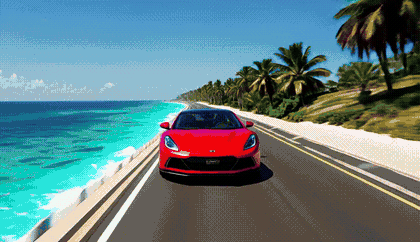

# SPED — Training-Free Interactive World Models

**🏆 $50,000 Grand Prize Winner — 2026 Inference-Time Compute Hackathon** (Etched × Mercor × Cognition × Anthropic)

Talk to a video model **while it generates**. SPED makes autoregressive video diffusion interactive at real-time speeds: speak a new prompt mid-generation and the scene morphs smoothly — **no training, no data, no cache resets** — with **0.69 s end-to-end from voice to pixels**.

## Demos

| | |
|:---:|:---:|
|  |  |
| *"dog running in meadow" → **winter background replaces meadow*** | *"luxury car near beach" → **neon city replaces beach*** |
|  |  |
| *"beach scene" → **a storm erupts on the beach*** | *"dog running through meadow" → **dog becomes wolf in winter*** |

## How it works

Four pieces, all inference-time — no fine-tuning, no adapters, no training data:

1. **Training-free prompt injection** — during a transition, each new chunk is conditioned on a *linear interpolation between the old and new prompt embeddings*, so the scene morphs instead of jump-cutting. The KV cache is never invalidated. Works on any prompt-conditioned autoregressive video diffusion model.
2. **SPED (Spectral Progressive Diffusion)** — denoising made spectrally autoregressive in the frequency domain: early steps work on low-frequency structure, later steps add high-frequency detail. ~10% throughput gain, no quality loss.
3. **Fused kernels** — FlashAttention 3 for the attention-dominated share of step time, plus custom fused RMSNorm (**7.71×**) and fused SiLU gate (**1.68×**) kernels for the memory-bound share.
4. **Pipeline parallelism** — DiT denoising on GPU 0 (~700 ms/chunk), VAE decode on GPU 1 (~276 ms/chunk), connected by a FIFO queue over NVLink. Decode is fully hidden; **28% lower end-to-end latency**.

## Results

- **Faster than playback** — 700 ms of compute per chunk containing 750 ms of video
- **0.69 s** from spoken words to generated pixels (ASR → embed → inject → first affected chunk)
- Smooth mid-stream scene transitions with zero training and zero data

**📄 Full write-up:** [Training-Free Interactive World Models](https://hrdlabs.org/research/interactive-world-models/)

## Team

Ray Kasichainula · Subha Vadlamannati · Bryan Dong · Gino Chiaranaipanich — HRD Labs
